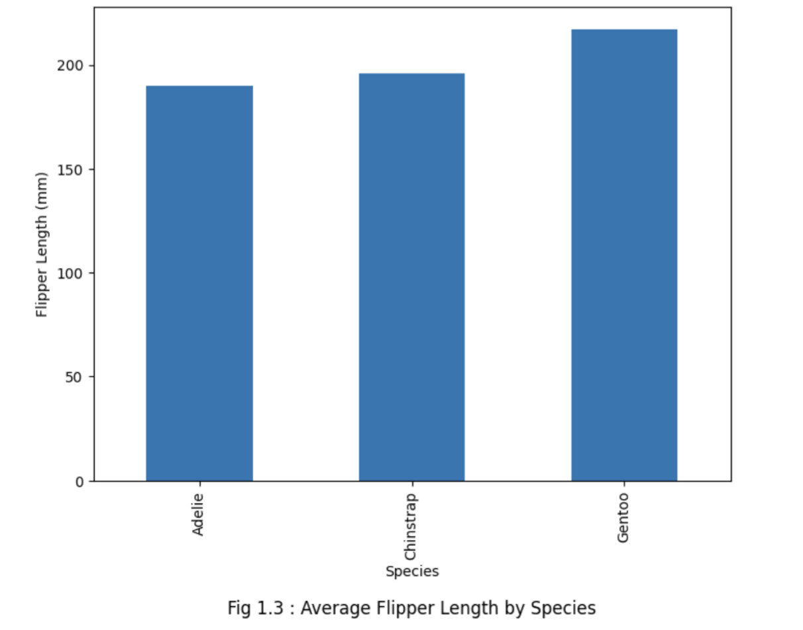

# Penguins Dataset Analysis and Visualisation

This project involves the analysis of the Palmer Penguins dataset, focusing on the morphological diversity and adaptations of three penguin species. The aim is to reveal patterns that may indicate potential adaptations and to further research on the climate change impact on penguins.

## Team
- **Rahul MR (20211CSE0205)**
- **Allen Conroy Dsouza (20211CSE0227)**
- **G Akash (20211CSE0420)**

## Abstract
This project explores the adaptations of penguin species to their environments by analyzing their morphological features. The insights gained from this study aim to support further research on climate change and its impact on penguin habits.

## Data Collection and Preprocessing
- **Dataset**: Palmer Penguins Dataset
- **Preprocessing**: Data cleaning and variable encoding
    - Before preprocessing: 344 rows x 7 columns
    - After preprocessing: 342 rows x 8 columns
- **Tools Used**:
    - Python
    - Google Colab
- **Libraries Used**:
    - Pandas
    - Matplotlib
    - Scikit-learn

**Screenshot Before Preprocessing**  

**Screenshot After Preprocessing**  

## Key Problems Addressed
1. Which penguin species has the highest body mass, and is there a significant difference in body mass across islands?
2. Is there a correlation between bill-length and bill-depth across species?
3. Is there evidence of sexual dimorphism in body mass within each species?
4. Which physical characteristics show the strongest correlation with each other?
5. How does flipper length differ among species?

## Results

### Body Mass Distribution
The box plot reveals that the body mass of penguins varies significantly across different species and islands.
The Gentoo penguins generally have a higher body mass compared to the Adelie and Chinstrap penguins.
There are also differences in body mass distribution within the same species across different islands, suggesting potential environmental or ecological factors influencing their body mass.

**Screenshot of Body Mass Distribution**  

### Bill Morphology
The scatter plot of bill length versus bill depth shows distinct clusters for each penguin species, indicating species-specific bill morphologies.
The Gentoo penguins tend to have longer and deeper bills compared to the Adelie and Chinstrap penguins.
The bill morphology may be adapted to different feeding habits or ecological niches occupied by each species.

**Screenshot of Bill Morphology**  

### Flipper Length
The bar plot reveals that the Gentoo penguins have, on average, longer flipper lengths compared to the Adelie and Chinstrap penguins.
Flipper length may be an adaptation for different swimming and foraging behaviors among the species.

**Screenshot of Flipper Length**  

### Body Mass and Sex
The violin plot suggests that there are differences in body mass distribution between males and females within each penguin species.
Male penguins tend to have a higher average body mass compared to females, which could be attributed to sexual dimorphism.

**Screenshot of Body Mass and Sex**  

### Correlation Analysis
The heatmap of the correlation matrix shows varying degrees of correlation between the different physical characteristics (bill length, bill depth, flipper length, and body mass) for each penguin species.
These correlations may provide insights into the morphological adaptations and trade-offs among different traits within each species.

**Screenshot of Correlation Analysis**  

## Machine Learning Algorithms
- **Target**: Predicting Penguin Species
- **Features**: Bill length, bill depth, flipper length, body mass, sex, island
- **Algorithms Used**:
    - Support Vector Machine (Accuracy: 99%)
    - RandomForestRegressor (Accuracy: 97%)

**Screenshot of SVM Model**  

**Screenshot of Random Forest Model**  

## Limitations
- Limited feature set
- Handling missing data
- Model validation and evaluation could be improved to avoid biased results

## Future Scope
1. Expand the dataset for further research.
2. Explore additional machine learning models and ensemble techniques.
3. Integrate geospatial data to model penguin distribution based on predicted species.
4. Develop a web application to visualize penguin species distribution.

## Conclusion
This project provides valuable insights into the morphological diversity of penguins and their adaptations. The results contribute to a better understanding of penguin species and potential conservation strategies.

## What We Learned
- Data analysis and preprocessing techniques
- Visualizing relationships between penguin species traits
- Hands-on experience with machine learning models

## Acknowledgments
We would like to thank our instructors and fellow team members for their guidance and support in this project.
